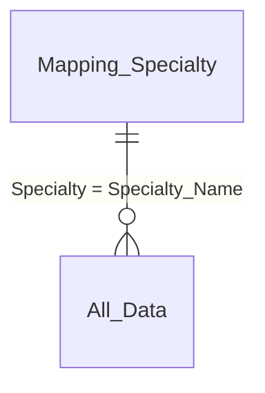

# Data Model

Reconstructed from the Power BI Desktop model view (tables pane + relationship
canvas). Star schema, one fact table (`All_Data`) plus a specialty lookup.

## Tables

| Table | Type | Grain | Source |
|---|---|---|---|
| `Inpatient` | Fact (staging) | One row per Archive_Date x Specialty x Case_Type x Adult_Child x Age_Profile x Time_Bands | `data/processed/Inpatient.csv` |
| `Outpatient` | Fact (staging) | Same grain as Inpatient | `data/processed/Outpatient.csv` |
| `All_Data` | Fact | `Inpatient` UNION `Outpatient`, joined to `Mapping_Specialty` | `data/processed/All_Data.csv` |
| `Mapping_Specialty` | Dimension | One row per Specialty | `data/mapping/Specialty_Mapping.csv` |
| `Calc Method` | Disconnected parameter | "Average" / "Median" | Created in Power BI (see below) |

`Inpatient` and `Outpatient` are kept as separate queries (matching the two
"Transform File from Inpatient" / "Transform File from Outpatient" folder-combine
queries in the video) so each can be spot-checked independently; `All_Data` is
what the report actually visualizes against.

## Relationships



- `Mapping_Specialty[Specialty]` **(1)** → `All_Data[Specialty_Name]` **(\*)**
- Cross-filter direction: single (Mapping_Specialty filters All_Data)
- `Calc Method` has **no relationship** — it's a disconnected table used purely
  to drive `SELECTEDVALUE()` inside the `[Avg/Med Wait]` measure via a slicer.

## Column list (`All_Data`)

| Column | Type | Notes |
|---|---|---|
| `Archive_Date` | Date | Monthly snapshot date NTPF published the file under |
| `Specialty_HIPE` | Whole number | HIPE specialty code |
| `Specialty_Name` | Text | e.g. "Ophthalmology" |
| `Case_Type` | Text | `Inpatient` / `Day Case` / `Outpatient` |
| `Adult_Child` | Text | `Adult` / `Child` |
| `Age_Profile` | Text | e.g. `0-15`, `16-64` |
| `Time_Bands` | Text | e.g. `0-3 Months`, `3-6 Months`, ... `15-18 Months` |
| `Total` | Whole number | Patients waiting in that bucket |
| `Source_Name` | Text | Originating raw file name (lineage/audit) |
| `Specialty_Group` | Text | From `Mapping_Specialty`, e.g. "Heart", "Bones" |

## Building `Calc Method` in Power BI

Modeling → New Table:

```
Calc Method = DATATABLE(
    "Method", STRING,
    {{"Average"}, {"Median"}}
)
```

Add a slicer on `Calc Method[Method]` on the report canvas — this is the
control behind the "Avg/Med Wait" card and the "Avg/Med Wait List by..."
charts in the screenshots.

## Building `Time_Bands_Midpoint` (needed for the wait-time measures)

`Time_Bands` is categorical, so computing a numeric average/median wait
requires a bridge table assigning each band a midpoint in months. **Which
table you need depends on which era of NTPF file you loaded** — see
`docs/data_dictionary.md` for why the band widths differ:

Current "by Speciality" open data (2021+) and the sample data shipped in
this repo use 4 bands:

```
Time_Bands_Midpoint = DATATABLE(
    "Time_Bands", STRING, "Midpoint_Months", DOUBLE,
    {
        {"0-6 Months",   3.0},
        {"6-12 Months",  9.0},
        {"12-18 Months", 15.0},
        {"18+ Months",   24.0}
    }
)
```

Older long-format exports (2014-2020, matching the `IN_WL 2018`-style file)
use 7 finer bands instead:

```
Time_Bands_Midpoint =
DATATABLE(
    "Time_Bands", STRING, "Midpoint_Months", DOUBLE,
    {
        {"0-3 Months",   1.5},
        {"3-6 Months",   4.5},
        {"6-9 Months",   7.5},
        {"9-12 Months",  10.5},
        {"12-15 Months", 13.5},
        {"15-18 Months", 16.5},
        {"18+ Months",   21.0}
    }
)
```

Relate `Time_Bands_Midpoint[Time_Bands]` **(1)** → `All_Data[Time_Bands]` **(\*)**.

> Check `All_Data[Time_Bands].unique()` after loading your own downloaded
> files before picking a table — don't assume one without checking, since
> mixing years without normalising will silently blend both shapes in Power
> Query if you're not careful (the Python ETL's `transform_file()` already
> normalises this — see its docstring).
